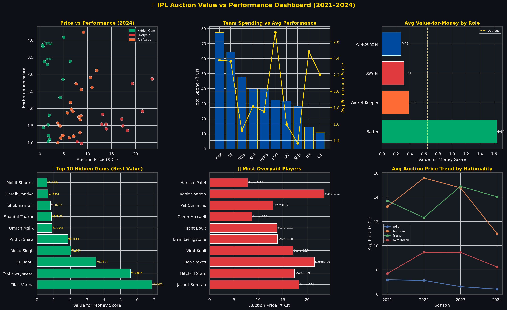
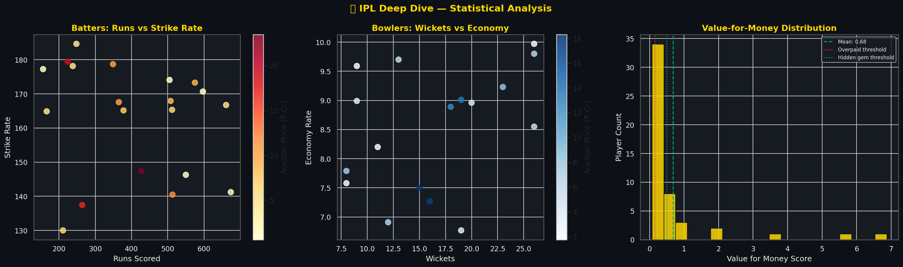

# 🏏 IPL Auction Value vs Performance Analyzer

> **Data Analyst Portfolio Project** | Author: Somya Shrivastava

---

## 📌 Project Overview

This project analyzes **200 player records across 4 IPL seasons (2021–2024)** to answer one critical question every team management asks: **Are we spending our auction money wisely?**

The analysis identifies hidden gems (underpriced high-performers), overpaid stars, and team-level spending efficiency using data-driven metrics.

---

## 🎯 Business Questions Answered

1. Which players give the best value for their auction price?
2. Which big-money signings have underperformed (overpaid)?
3. Which teams spend the most — and do they get returns?
4. Are Indian or overseas players better value for money?
5. How have auction prices inflated season over season?
6. Which role (Batter/Bowler/All-Rounder) gives best ROI?

---

## 📊 Key Insights (2024 Season)

| Insight | Finding |
|---|---|
| Best Value Player | **Tilak Varma (MI)** — ₹0.56 Cr, highest value score |
| Most Overpaid | **Jasprit Bumrah (MI)** — ₹18.3 Cr, lowest value score |
| Biggest Spender | **CSK** — ₹77.4 Cr total squad spend |
| Hidden Gems Found | **13 players** under ₹5 Cr with elite performance |
| Overpaid Players | **12 out of 50** analyzed |
| Best Value Role | **Batters** — highest avg value for money |

---

## 🛠️ Tools & Technologies

| Tool | Usage |
|---|---|
| **Python (Pandas, NumPy)** | Data generation, wrangling, analysis |
| **Matplotlib & Seaborn** | Dark-theme IPL dashboards |
| **SQL (MySQL)** | Ranking, aggregations, YoY comparison |
| **Power BI / Excel** | Interactive reporting |

---

## 📁 Project Structure

```
ipl-auction-analyzer/
│
├── ipl_auction_data.csv       # Dataset (200 records, 4 seasons)
├── generate_data.py           # Data generation script
├── eda_analysis.py            # Full EDA + visualizations
├── queries.sql                # 8 business SQL queries
├── ipl_dashboard.png          # Main dashboard (dark theme)
├── ipl_deep_dive.png          # Statistical deep dive
└── README.md
```

---

## 📈 Visualizations

### Main Dashboard


### Deep Dive Analysis


---

## ▶️ How to Run

```bash
python generate_data.py    # Generate dataset
python eda_analysis.py     # Run full EDA
# Load CSV in MySQL and run queries.sql
```

---

## 💡 Business Recommendations

1. **Prioritize All-Rounders** — best value per crore spent
2. **Cap big-name bids at ₹15 Cr** — star player premium rarely justified by performance
3. **Scout uncapped Indian players** — hidden gems consistently outperform expensive overseas buys
4. **Use performance score model** pre-auction to set bid limits
5. **Review YoY performance trends** before retaining players at higher prices

---

*Portfolio project using synthetic data modeled on real IPL auction patterns (2021–2024).*
